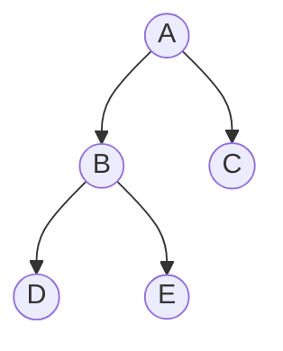
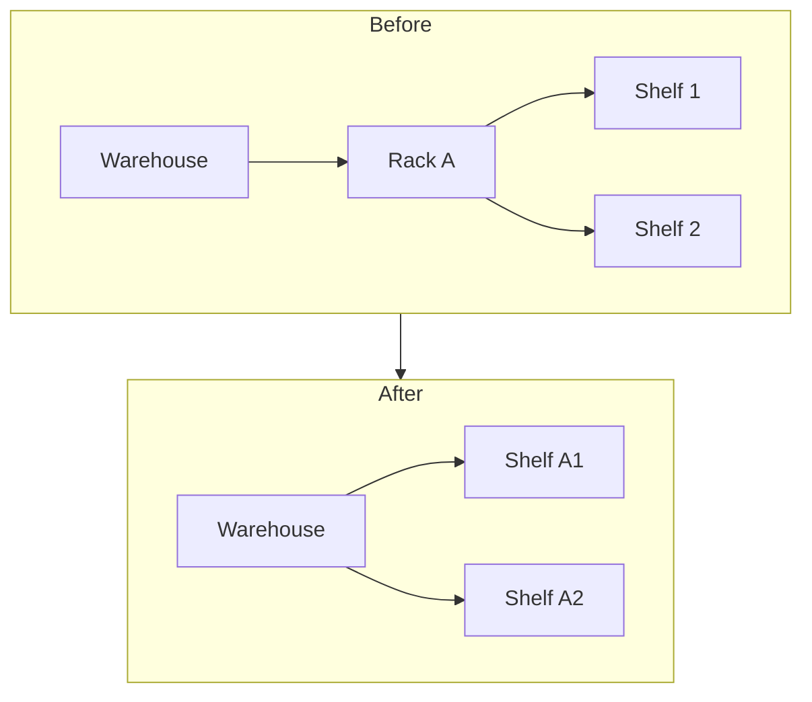
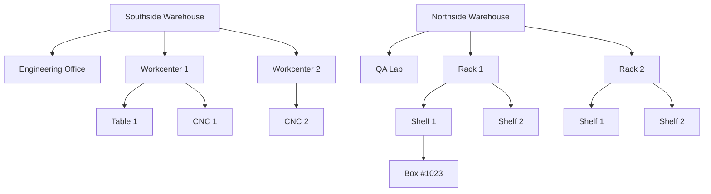

import { Callout } from 'nextra/components'

# Locations

Locations are a foundational representation of *where* a given item is. This applies to all manor of objects like stock, equipments, workcenters.

## Locations are a tree

By representing each location as being a sub-location of another (except for the root location), we can define where an item is with varying levels of specificity.

<Callout>
Consider yourself a purcahsing officer who is organising an order of widgets to the 'Southside Warehouse'. At this stage you don't want to specify exactly where the incomming stock will reside, so you simply select the Southside location. Upon receiving the goods, the warehous manager can then select the specific location Rack 4 → Shelf 2 to place the goods.
</Callout>

## Locations don't have to be complicated

A location tree that is too deep can be difficult to work with and navigate. If you find yourself in this sitation, it may be a good idea to 'flatten' the location tree by moving some of the locations into their parent location.

Here is an example:

After flattening the tree we know that 'Shelf A1' is in rack 'A' because it's in the name and there is no other shelf with the same name.

## An in-depth example

Here is an exmaple of two fictional warehouses. Note that because the warehouses are in physically separate locations, they do not share any sub-locations.

