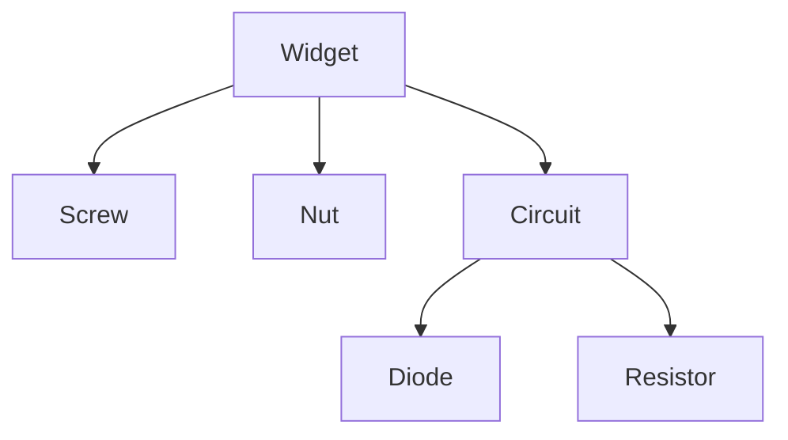

# Parts

Parts make up the core of the inventory management module of Optimize. A part is any material, component or assembly internal or from a supplier.

## Parts can be internal or external

Unlike other inventory mangement systems that divide components into parts and materials, Optimize uses a unified model to represent these two concepts. An internal part is just a component that has your own company listed as a supplier.

## Parts can be assemblies

Similar to [Locations](/concepts/locations) parts can reference sub-parts to become assemblies. This allows common parts to be shared between asemblies.

In the above example, the widget has two sub-parts and one sub-assembly which in turn contains two sub parts.

## A new revision is a new part

New revisions are stored as new parts allowing editing and use of old revisions in designs, assemblies, orders, etc.

## Parts have labels

Labels allow adding arbitrary metadata to parts that is otherwise or not yet supported by Optimize.
