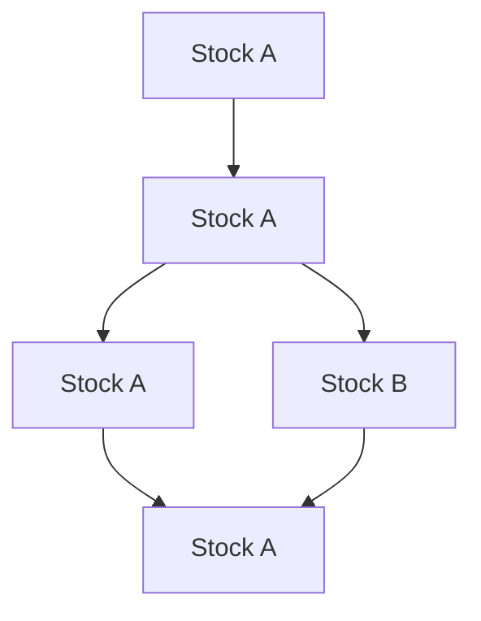

import { Callout } from 'nextra/components'

# Stock

Stock is how inventory levels are represented. Multiple stock items can exist for a given part, and each stock item is assigned a location.

## Stock has a location

Every instance of 'stock' is assigned to a location.

See [Locations](/concepts/locations) for more details on the concepts behind locations.

## Stock changes are a ledger

It's not good enough to only track the current quantity of a part, so we track
every change to the stock level and metadata about when, why and how the stock change occured.

## Stock changes to quantity split the stock

When partial quantity is taken from a stock location and moved to another location, the stock is split in two.

## Stock with the same location and unit of measure coalesce

If stock is moved from into a location that already has stock of the same part with the same unit of measure, they will be combined into a single stock item. This

## Stock changes can transmute one part into another

A stock change can link the act of one part being transformed into another part and the resulting change in quantity for both parts.

<Callout>
Consider a manufacturing process turning a block of steel into a bracket.
</Callout>
